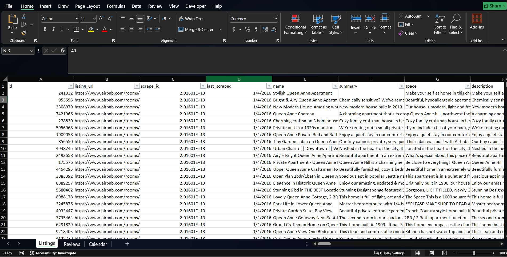
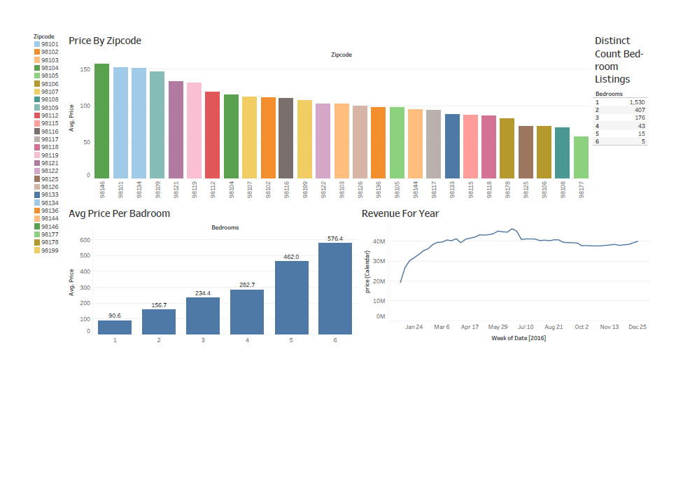

# 🏠 Airbnb 2016 Data Analysis

## 📊 Project Overview
This project analyzes Airbnb listings data from 2016 to uncover insights about pricing, distribution, and revenue trends.

---

## 📂 Dataset Preview

- The dataset contains information about listings such as price, location, and property details.

---

## 📸 Dashboard Preview

---

## 🔍 Key Insights

- Significant variation in prices across different zipcodes  
- Strong positive relationship between number of bedrooms and price  
- Revenue shows clear seasonal trends  
- Majority of listings are small (1-bedroom units)  

---

## 🧠 Key Takeaways

- Location is a critical pricing factor  
- Smaller listings dominate the market  
- Pricing strategy should consider seasonality  

---

## 🛠️ Tools Used
- Tableau  
- Excel  

---

## 📥 Full Project
You can find the full dashboard in the attached PDF file.

---

## 📬 Contact
Feel free to connect with me on LinkedIn.
